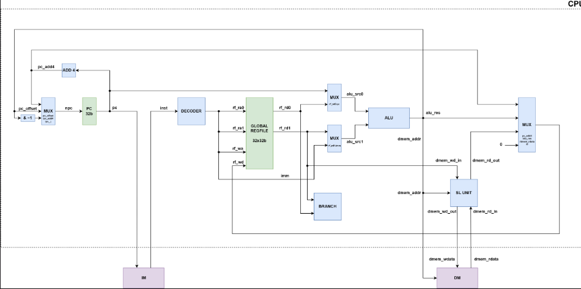

# Lab 4 report

## 实验目的与内容

1. **简述本次实验做的内容以及本次实验的目的、逻辑设计**
   - 通过 Verilog 硬件描述语言实现一个可用的完整单周期 CPU。实验四进行单周期CPU访存和跳转指令相关的功能部件的搭建。
   - 此次实验在实验三的基础上进行其他类型指令的执行，实现CPU的各子模块的设计，包括实现`SLU`、`BRANCH`等模块，最后需要在龙芯框架中运行仿真测试并上板验证结果。

2. 请参照PPT画出你设计的各模块的框图和数据通路，
    
3. 如果存在状态机，请绘制出状态机的状态转换图；
    > 无。
4. 请贴出较为核心的代码设计代码，并加以解释说明。
   见第二部分。

## 具体实验任务

### NPC选择器


在龙芯操作指令中，不需要用到`pc_j`，但为方便起见，我们还是将选择信号定义为两位，`npc_sel`信号我们在译码阶段产生即可，此处实现对下一条指令取值地址做选择即可。

```c
module NPC_MUX (
    input                   [ 31: 0]            pc_add4,
    input                   [ 31: 0]            pc_offset,
    //input                   [ 31: 0]            pc_j,
    input                   [ 1 : 0]            npc_sel,

    output      reg         [31 : 0]            npc
);

always @(*) begin
    if(npc_sel == 2'b00)begin
        npc = pc_add4;
    end 
    else if(npc_sel == 2'b01)begin
        npc = pc_offset;
    end
    else
        npc = 32'b0;
end
endmodule
```

### 分支模块

**任务**：可以注意到，跳转相关的指令源操作数和`ALU`的来源相同，因此可以直接接线到`BRANCH`的输入进行判断。跳转条件根据指令定义进行执行即可，该部分利用`case`语句完成。


```c

`define beq      4'b0001
`define bne      4'b0010
`define blt      4'b0011
`define bge      4'b0100
`define bltu     4'b0101
`define bgeu     4'b0110
`define jirl     4'b0111
`define b        4'b1000
`define bl       4'b1001

module BRANCH(
    input                   [ 3 : 0]            br_type,

    input                   [31 : 0]            br_src0,
    input                   [31 : 0]            br_src1,

    output      reg         [ 1 : 0]            npc_sel
);

reg signed [31:0] a_signed;
reg signed [31:0] b_signed;
always @(*) begin
    a_signed = $signed(br_src0);
    b_signed = $signed(br_src1);
end

always @(*) begin
    case (br_type)
        `beq:begin
            if(br_src0 == br_src1)begin
                npc_sel = 2'b01;
            end
            else 
                npc_sel = 2'b00;
        end
        `bne:begin
            if(br_src0 != br_src1)begin
                npc_sel = 2'b01;
            end
            else 
                npc_sel = 2'b00;
        end
        `blt:begin
            if(a_signed < b_signed)begin
                npc_sel = 2'b01;
            end
            else 
                npc_sel = 2'b00;
        end
        `bge:begin
            if(a_signed >= b_signed)begin
                npc_sel = 2'b01;
            end
            else 
                npc_sel = 2'b00;
        end
        `bltu:begin
            if(br_src0 < br_src1)begin
                npc_sel = 2'b01;
            end
            else 
                npc_sel = 2'b00;
        end
        `bgeu:begin
            if(br_src0 >= br_src1)begin
                npc_sel = 2'b01;
            end
            else 
                npc_sel = 2'b00;
        end

//--------------------------------------
    
        `b:begin
            npc_sel = 2'b01;
        end
        `bl:begin
            npc_sel = 2'b01;
        end
        `jirl:begin
            npc_sel = 2'b01;
        end
        default: begin
            npc_sel = 2'b00;
        end
    endcase
end

endmodule
```

- 此外，按照cpu数据通路的要求，`pc`自增的操作在cpu模块中完成而不在PC 寄存器中完成。

```c
wire    [31 : 0]    cur_pc,cur_npc,cur_inst;
assign cur_npc = cur_pc + 32'h4;//CPU模块中的wire操作
```

### 译码器的修改

**任务**：负责根据输入的指令生成相应的控制与数据信号。实验三需要实现所有寄存器指令的译码。根据龙芯的编码规则需要分别取出指令中源寄存器，目的寄存器，操作码以及生成寄存器堆的写使能信号。除此之外，实验四需要生成新定义模块需要的控制和选择信号，例如访存类型，跳转类型的区分等等。

具体代码如下：（以访存指令ld.w为例）

- 在指令操作码部分，我们注意到其实将访存操作移出`ALU`之后，所用访存指令都只涉及到地址偏移的计算，因此本质上都是加法指令，因此翻译的操作码也与加法相同。
- 此外生成`LD.W`对应的访存类型，访存指令不涉及跳转，不涉及跳转的指令我们统一设置为0。
  
```c
//涉及到了访存指令。
    else if(inst[31:22] == 10'b00101_00010)begin//ld.w rd,rj,si12----------LD : 24
        alu_op = 5'b00000;//24
        imm = {{20{inst[21]}},inst[21:10]};
        rf_ra0 = inst[9 : 5];           //ra0 = rj
        rf_ra1 = inst[14:10];           //ra1 = rk
        rf_wa  = inst[4 : 0];           //wa  = rd
        rf_we  = 1'b1;
        alu_src0_sel = 1'b1;
        alu_src1_sel = 1'b1;

        dmem_access = 4'b0001;
        rf_wd_sel = 2'b10;
        br_type = 4'b0;

        dmem_we = 1'b0;

    end
```

### 访存控制单元——SLU


- 这一块根据IP核的寻址特性（按四的倍数寻址），设置加载/存储的规则，同时不允许非法的访问（例如半字访问对中间两字进行访问）。
- 同时注意`ST`系列存储半字和一个字节，都只存储低位。（本人在这里摔了大坑）。

```c
module SLU (
    input                   [31 : 0]                addr,
    input                   [ 3 : 0]                dmem_access,

    input                   [31 : 0]                rd_in,
    input                   [31 : 0]                wd_in,

    output      reg         [31 : 0]                rd_out,
    output      reg         [31 : 0]                wd_out
    //output      reg         [31 : 0]                dmem_wa
);

wire [1:0] temp;//0~3
assign temp = addr[1:0];

always @(*) begin
    case (dmem_access)
        4'b0001: begin//ld.w指令
            wd_out = wd_in;
            rd_out = rd_in;
            //dmem_wa = 0;
        end 
        4'b0010:begin//ld.h指令_加载半字。
            wd_out = wd_in;
            //dmem_wa = 0;
            case (temp)
                2'b00: begin
                    rd_out = {{16{rd_in[15]}},rd_in[ 15 : 0]};
                end
                2'b10: begin
                    rd_out = {{16{rd_in[31]}},rd_in[31 : 16]};
                end
                default:begin
                    rd_out = 32'b0;
                end
            endcase
        end
        4'b0011:begin//ld.b指令_加载一个字节
            wd_out = wd_in;
            //dmem_wa = 0;
            case (temp)
                2'b00: begin
                    rd_out = {{24{rd_in[7]}},rd_in[ 7 : 0]};
                end
                2'b01: begin
                    rd_out = {{24{rd_in[15]}},rd_in[ 15 : 8]};
                end
                2'b10: begin
                    rd_out = {{24{rd_in[23]}},rd_in[ 23 : 16]};
                end
                2'b11: begin
                    rd_out = {{24{rd_in[31]}},rd_in[31 : 24]};
                end
            endcase
        end

        4'b0100:begin//ld.hu指令_加载半字。
            wd_out = wd_in;
            //dmem_wa = 0;
            case (temp)
                2'b00: begin
                    rd_out = {{16'b0},rd_in[ 15 : 0]};
                end
                2'b10: begin
                    rd_out = {{16{1'b0}}, rd_in[31:16]};
                end
                default:begin
                    rd_out = 32'b0;
                end
            endcase
        end

        4'b0101:begin//ld.bu指令_无符号加载一个字节
            wd_out = wd_in;
            //dmem_wa = 0;
            case (temp)
                2'b00: begin
                    rd_out = {{24'b0},rd_in[ 7 : 0]};
                end
                2'b01: begin
                    rd_out = {{24'b0},rd_in[ 15 : 8]};
                end
                2'b10: begin
                    rd_out = {{24'b0},rd_in[ 23 :16]};
                end
                2'b11: begin
                    rd_out = {{24'b0},rd_in[31 : 24]};
                end
            endcase
        end
        4'b0110: begin//st.w指令
            wd_out = wd_in;
            rd_out = rd_in;
            //dmem_wa = addr;
            
        end

        4'b0111:begin//st.h指令_存储半字。
            rd_out = rd_in;
            //dmem_wa = addr;
            case (temp)
                2'b00: begin
                    wd_out = {rd_in[31 : 16],wd_in[ 15 : 0]};
                end
                2'b10: begin
                    wd_out = {wd_in[31 : 16],rd_in[ 15 : 0]};
                end
                default:begin
                    wd_out = 32'b0;
                end
            endcase
        end

        4'b1000:begin//st.b指令_存储一个字节
            rd_out = rd_in;
            case (temp)
                2'b00: begin
                    wd_out = {rd_in[ 31 : 8],wd_in[ 7 : 0]};
                end
                2'b01: begin
                    wd_out = {rd_in[ 31 : 16],wd_in[ 15 : 8],rd_in[ 7 : 0]};
                end
                2'b10: begin
                    wd_out = {rd_in[ 31 : 24],wd_in[ 23 : 16],rd_in[ 15 : 0]};
                end
                2'b11: begin
                    wd_out = {wd_in[ 31 : 24],rd_in[23 : 0]};
                end
            endcase
        end


        default: begin
            rd_out = 32'b0;
            wd_out = 32'b0;
        end
    endcase
end
endmodule
```

#### 仿真结果


在龙芯仿真框架下进行仿真验证，结果正确符合预期。

#### 上板结果


上板结果前16个寄存器的值与`LARS`运行结果一致。

## 总结

1. 如图
    - 
    - 设计方案：
  
        - 声明四个临时寄存器，分别用于写入（读取）的每一个字节操作后的暂时结果。
        - 对控制信号we做判断，以决定是加载还是存储。
        - 依次对每一位`mask`进行判断，如果为1则进行相应的加载和存储处理。
        - 在存储中，未访问的仍保持原值。在加载中，无效的字节全部置0。
        - 每一轮的临时寄存器通过`assign`语句接到下一个寄存器的结果。
        - 最后将结果输出。
2. 请指出本次实验的 CPU 中可能的关键路径。
    - 关键路径从`pc`计数开始，随后进入指令存储器取指，然后进行译码，进入寄存器堆取出操作数，经过多路选择器后进入`alu`计算，计算结果进入SLU作为寻址地址加载数据，经过最后的选择器写回寄存器堆，这个是一个可能的关键路径。
